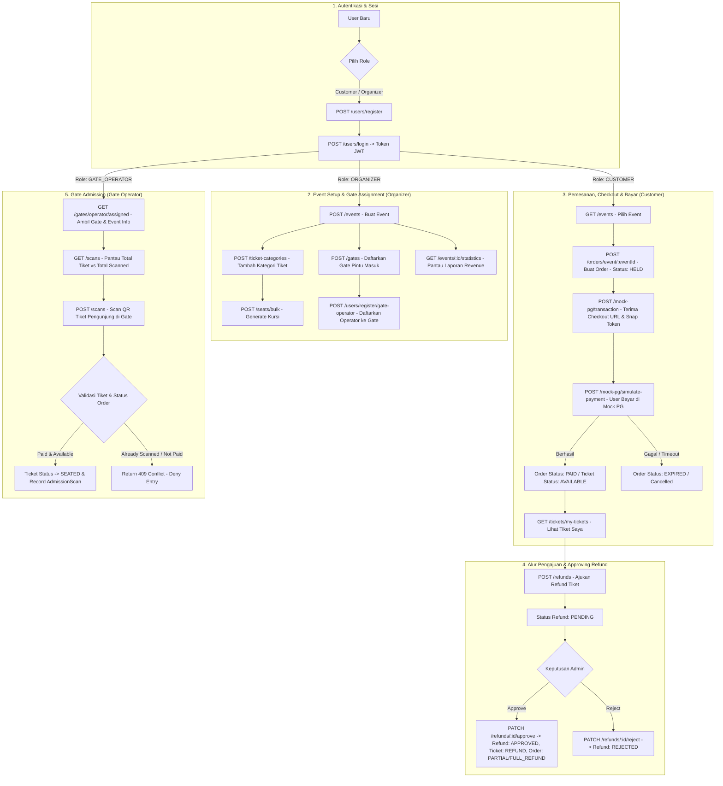
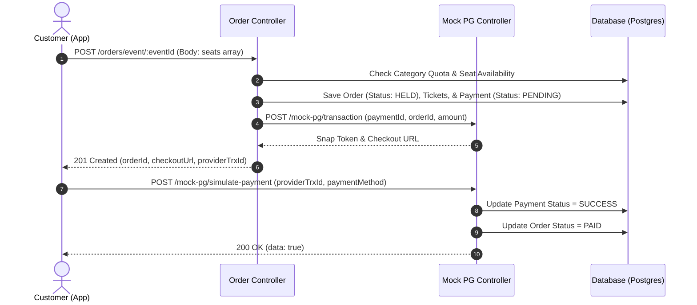
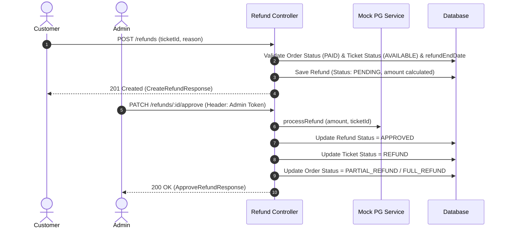
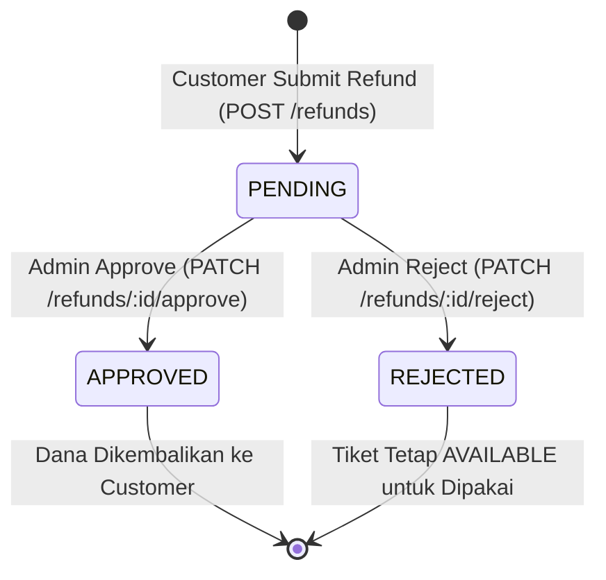

# Tim Lima Backend - User Flow & System Workflows (Latest Specification)

Dokumen ini menjelaskan seluruh **User Flow (Alur Pengguna & Bisnis)** dalam sistem Backend **Tim Lima BE**, dilengkapi dengan diagram alur visual (**Mermaid Diagrams**) dan State Machine diagram terbaru.

---

## 1. Peran Pengguna (System Roles)

1. **`CUSTOMER`**: Jelajah event -> Pilih kursi/kategori -> POST /orders/event/:id (Order Created) -> Pembayaran via Payment Gateway (`/mock-pg`) -> Dapat Tiket Aktif (`GET /tickets/my-tickets`) -> Pengajuan Refund (`POST /refunds`).
2. **`ORGANIZER`**: Setup Event & Kategori Tiket -> Bulk Seats -> Daftarkan Gate & Penugasan Gate Operator (`POST /users/register/gate-operator` dengan `gateId`) -> Pantau Statistik & Revenue (`GET /events/:id/statistics`) & Monitoring Refund.
3. **`GATE_OPERATOR`**: Ditugaskan pada `gateId` tertentu. Melakukan pemindaian QR Tiket di pintu masuk (*Gate Admission Scan*).
4. **`ADMIN`**: Peninjauan dan persetujuan pengajuan refund (`PATCH /refunds/:id/approve` / `PATCH /refunds/:id/reject`) dan pengawasan sistem secara menyeluruh.

---

## 2. Diagram Alur Utama (End-to-End System Flow)

---

## 3. Detail Sub-Flow & Diagram Spesifik

### 3.1 Alur Pemesanan (Order) & Simulasi Pembayaran Payment Gateway

---

### 3.2 Alur Pengajuan Refund & Persetujuan Admin

---

### 3.3 State Machine: Refund Lifecycle

---

## 4. Ringkasan Business Rules Utama

1. **Order Creation & Hold Constraints**:
   - Pemesanan (`POST /orders/event/:eventId`) memverifikasi sisa kuota kategori dan ketersediaan kursi.
   - Jika berhasil, pesanan masuk ke status `HELD` dan diberikan Snap Token pembayaran dari Mock PG.
2. **Refund Rules**:
   - Pengajuan refund (`POST /refunds`) hanya diperbolehkan jika tiket milik pengguna, status pesanan `PAID` / `PARTIAL_REFUND`, tiket berstatus `AVAILABLE`, dan waktu belum melewati `event.refundEndDate`.
   - Admin menyetujui refund via `PATCH /refunds/:id/approve` yang otomatis mengubah status tiket ke `REFUND` dan status pesanan ke `FULL_REFUND` (jika tidak ada tiket aktif tersisa) atau `PARTIAL_REFUND`.
3. **Gate Operator Assignment**:
   - Detail Gate (`GET /gates/:id` & `GET /gates/event/:eventId`) menyajikan perincian daftar petugas gerbang (`operators`) yang ditugaskan di gate tersebut.
